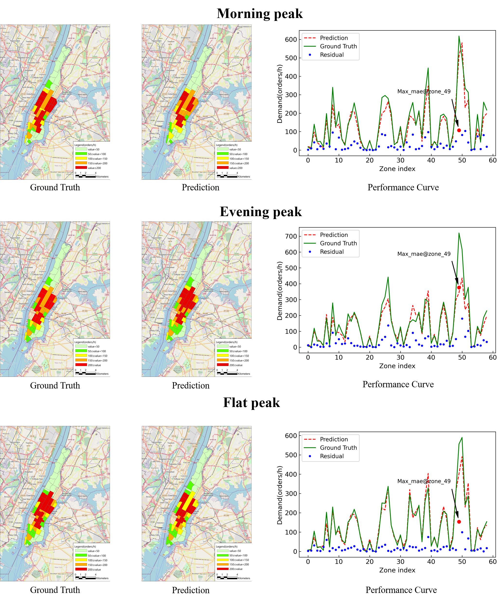

# STGMT-Tensorflow2-implementation
Traffic prediction based on spatiotemporal-guided multi graph Sandwich-Transformer(STGMT)


## Contents

- [Background](#background)
- [Preliminary](#preliminary)
	- [Dataset](#dataset)
	- [Weight](#weight)
- [Training](#training)
- [Testing](#testing)
- [Results](#results)
- [Contributing](#contributing)
- [License](#license)

## Background

Not only is spatiotemporal traffic prediction one of the important tasks of intelligent transportation system(ITS), but is an important part of urban computing. It is of great significance to aleviate traffic congesetion and improve urban operatiion. In recent years, Transformer has achieved great success in natural language processing(NLP) and computer vision(CV), so this paper is an extension of Transformer architecture and applies it to spatiotemporal traffic prediction. Specifically, our model respects the original framework of Transformer and is composed of encoder and decoder. The encoder is responsible for feature extraction of historical traffic data, and the decoder is responsible for autoregressive prediction of future traffic conditions.  Our model mainly includes three types of attention modules: multi-head temporal self attention(MTA), multi-head spatio self attention(MSA), and multi-head interactive attention(MTIA),in which MTA captures the features of historical traffic data in the temporal dimension, MSA captures the features of spatial dimension, and MTIA captures the features of historical-future temporal dimension. Moreover, because the original transformer is composed of dense layers, temporal and spatial essentially share parameters when performing attention operations, which ignores the heterogeneity of spatiotemporal. Therefore, the spatiotemporal embedding layer is introduced to guide the attention mechanism through meta learning. It encodes temporal and spatial through Time2Vec(T2V) and Node2Vec(N2V), and couples them into spatiotemporal embedding blocks. In addtion, the multi graph consists of accessibility graph and similarity graph is adopted to perform MSA, aiming to make full use of spatial domain knowledge. We recombine the attention module and the feed forward layer to form the Sandwich-Transformer. The model has carried out extensive experiments on two public data, and the results show that our model is superior to several most advanced methods.

## Preliminary
Before entering this project, you may need to configure the environment based on `Tensorflow2.x-gpu`.
```
pip install node2vec
```

### Dataset

If you want to run this project, please download the datasets and weight file from  the [Google](https://drive.google.com/drive/folders/1Dcsf1Y9MIQzZ6Th9abmNb4F9mlpZ2GpV?usp=sharingy). Then put the `ckpt_pems08` and `ckpt_taxi` into the project and crate a new file folder named `data` and put `NYC_taxi` and `PEMS08` into it. You must change the folder named `NYC_taxi->NYC`. After some tossing, you can run [data_fac.py](data_fac.py) to generate data files in `pkl format` for your training and testing, which may be a long wait. The `pkl flie` consists of 5 parts->`traind data`, `validation data`, `test data`, `multi graph`, `node2vec results`, and  `inverse_transform scalar `

### Weight
If you just want to inference and not train your own datasets, you can modify any dataset and name it `ckpt`, for example `ckpt_pems08->ckpt`


## Training
The backbone STGMT


The [layer.py](layer.py) and [framework.py](framework.py) are the most important componets in this project. Moerover, You can come up with some innovative and great ideas and you can also can change the hyperparmetes in the [Hyperparameters.py](Hyperparameters.py) if you like .Before train your own datasets, you can just change the [train.py](train.py), `line 24` you can change your datasets path from [Hyperparameters.py](Hyperparameters.py), `line 53`, l2 loss is used and `line 55`, l1 loss is used if the datasets are senstive.
So you can finally train the model by running the following command:
```
python train.py
```
You will get a new file of your own trained weights saved in `ckpt` folders.Don't worry about getting an error, even if there are weight files in the folder, they will be overwritten during training.


## Testing 
If you only want to inferrence on our dataset, it doesn't matter. Take the dataset in New York as an example, PEMS08 performs the same operation
The [test.py](test.py) is the kernel, before testing, the operation as follows
```
change the data path-> line 16
change the graph name -> line 24 
change the test epoch is up to you -> line 32
change the data you want to save -> line 66, line 72
python test.py
```
We provide three metrics: `MAE`, `RMSE`, and `SMAPE`

In the end, the terminate will show the results of `3,6,9,12` steps errors and average errors of each steps. Three tables will saved into your project `multi_error_our.csv', 'pred.csv', and  `gt.csv`


## Results
The result of the NYC prediction:




More details please see the paper!

## Contributing


At last, thank you very much for the contribution of the co-author in the article, and also thank my girlfriend for giving me the courage to pursue for a Ph.d.

## License

[MIT](LICENSE) © YanjieWen

