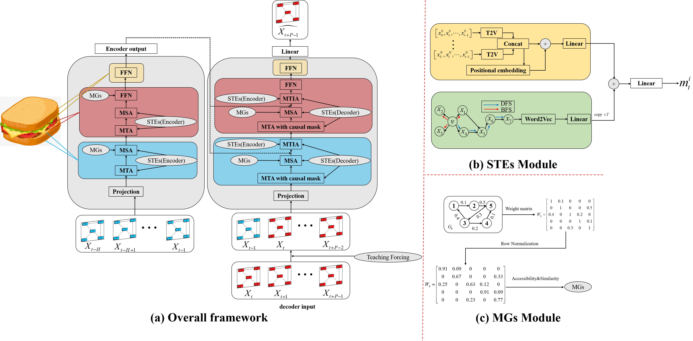
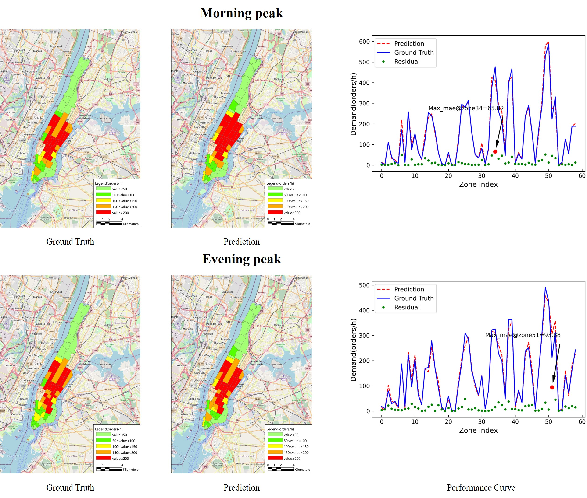

# STGMT-Tensorflow2-implementation
Traffic prediction based on -temporal guided multi graph Sandwich-Transformer(STGMT)


## Contents

- [Background](#background)
- [Preliminary](#preliminary)
	- [Dataset](#dataset)
	- [Weight](#weight)
- [Training](#training)
- [Testing](#testing)
- [Results](#results)
- [Contributing](#contributing)
- [License](#license)

## Background

The ability of spatial-temporal traffic prediction is crucial for urban computing, traffic management and future autonomous driving. In this paper, a novel spatial-temporal guided multi graph Sandwich-Transformer model (STGMT)  is proposed, which is composed of the encoder, decoder and attention mechanism modules. The three modules are responsible for feature extraction of historical traffic data, autoregressive prediction and capture the features of spatial-temporal dimension respectively. Compared to the original transformer framework, the spatial-temporal embedding layer's output is introduced to guide the attention mechanism through meta learning which considers the heterogeneity of spatial nodes and temporal nodes. The temporal and spatial features are encoded through Time2Vec(T2V) and Node2Vec(N2V), and coupled into spatial-temporal embedding blocks. In addition, the multi graph is adopted to perform multi-head spatial self attention(MSA). Finally, the attention module and the feed forward layer are recombined to form the Sandwich-Transformer.

## Preliminary
Before entering this project, you may need to configure the environment based on `Tensorflow2.x-gpu`.
```
!pip install node2vec
```

### Dataset

If you want to run this project, please download the datasets and weight file from  the [Google](https://drive.google.com/drive/folders/1SiCIIiJ9aejYxDNXSVNzly7S-fZ8tGaW?usp=sharing). Then put the `checkpoints_NYC` and `checkpoints_pems08` into the project as named 'checkpoints' .After some tossing, you can run [data_fac.py](data_fac.py) to generate data files in `pkl format` for your training and testing, which may be a long wait. The `pkl flie` consists of 5 parts->`traind data`, `validation data`, `test data`, `multi graph`, `node2vec results`, and  `inverse_transform scalar `

### Weight
If you just want to inference and not train your own datasets, you can modify any dataset and name it `checkpoints`, for example `checkpoints_pems08->checkpoints`


## Training
The backbone STGMT


The [operations.py](operations.py),[layer.py](layer.py) and [framework.py](framework.py) are the most important componets in this project. Moerover, You can come up with some innovative and great ideas and you can also can change the hyperparmetes in the [Hyperparameters.py](Hyperparameters.py) if you like .Before train your own datasets, you can just change the [train.py](train.py), `line 18` you can change your datasets path from [Hyperparameters.py](Hyperparameters.py), `line 52`, l1 loss is used.
So you can finally train the model by running the following command:
```
python train.py
```
You will get a new file of your own trained weights saved in `checkpoints` folders.Don't worry about getting an error, even if there are weight files in the folder, they will be overwritten during training. CheckpointManager in the code can guarantee continuous training or future training `line 62` to `line 68`. 

## Testing 
If you only want to inferrence on our dataset, it doesn't matter. Take the dataset in New York as an example, PEMS08 performs the same operation
The [test.py](test.py) is the kernel, before testing, the operation as follows
```
change the data path-> line 19
change error path and compare path -> line78, line 79
python test.py
```
We provide three metrics: `MAE`, `RMSE`, and `MAPE`

In the end, the terminate will show the results of `3,6,9,12` steps errors and average errors of each steps. Three tables will saved into your project `gap.csv	`, `pred.csv`, and  `ana.xlsx`


## Results
The result of the NYC prediction:




More details please see the paper!

## Contributing


At last, thank you very much for the contribution of the co-author in the article, and also thank my girlfriend for giving me the courage to pursue for a Ph.d.

## License

[MIT](LICENSE) © YanjieWen

